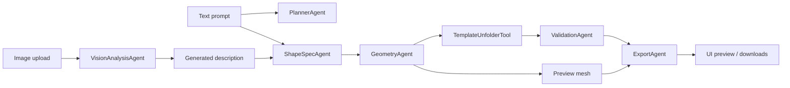

# Slab Lab App

Slab Lab App is a prototype that turns a ceramic vessel description or an uploaded reference image into an editable vessel spec, slab-building templates, preview geometry, validation output, and export bundles.

## Repository Layout

```text
backend/   Python backend project, API, CLI, tests, and backend venv
frontend/  React/Vite client
references/ Curated image references and source links
examples/  Generated sample exports
```

## What it does

- Text prompt or image upload
- Mock vision analysis for uploaded images
- Editable `VesselSpec`
- Deterministic geometry generation
- Slab-native box and tray families
- Multi-part slab assemblies with separate body/lid/handle parts
- SVG and PDF template exports
- OBJ preview mesh export
- ZIP bundle export
- FastAPI backend
- React frontend scaffold

## Architecture



## Backend

The backend is self-contained under `backend/`.

Create a virtual environment and install the backend dependencies:

```bash
cd backend
python -m venv .venv
.venv\\Scripts\\activate
pip install -r requirements-dev.txt
```

If the backend venv already exists, activate it instead of recreating it:

```powershell
cd backend
.\.venv\Scripts\Activate.ps1
```

For classic Command Prompt:

```bat
cd backend
.\.venv\Scripts\activate.bat
```

Set the Gemini API key before starting the backend if you want real image analysis:

```powershell
$env:GEMINI_API_KEY="your_gemini_api_key"
$env:SLABLAB_GEMINI_MODEL="gemini-3.5-flash"
$env:SLABLAB_GEMINI_MODEL_FALLBACKS="gemini-3.1-flash-lite"
```

For PowerShell persistence across sessions, add those variables to your profile or set them in your shell startup script.
On macOS or Linux:

```bash
export GEMINI_API_KEY="your_gemini_api_key"
export SLABLAB_GEMINI_MODEL="gemini-3.5-flash"
export SLABLAB_GEMINI_MODEL_FALLBACKS="gemini-3.1-flash-lite"
```

Install and run the API:

```bash
cd backend
python -m uvicorn slablab.api:app --reload --log-level info
```

Endpoints:

- `POST /api/analyze-image`
- `POST /api/spec-from-description`
- `POST /api/generate`
- `GET /api/jobs/{id}`
- `GET /api/files/{id}?name=template.svg`

The image endpoint accepts raw image bytes in the request body with an `X-Filename` header. That keeps the prototype lightweight and avoids a multipart dependency.
If `GEMINI_API_KEY` is set, the image path uses the official Google Gen AI SDK with `SLABLAB_GEMINI_MODEL` if provided, otherwise it starts with `gemini-3.5-flash` and then falls back to `gemini-3.1-flash-lite`. If the key is missing, the backend falls back to the mock analyzer and returns a warning.
Backend logs include image byte counts, selected model, provider success, and fallback reasons.

## CLI

Run these from `backend/` so the package and venv resolve correctly:

```bash
cd backend
python -m slablab generate --description "A tall twelve-petal tulip vase that flares outward" --out ./outputs
python -m slablab analyze-image --image ./reference.jpg --out ./outputs
```

## Frontend

The frontend lives in `frontend/` and is a React/Vite scaffold.

```bash
cd frontend
npm install
npm run dev
```

Set `VITE_API_BASE_URL` if the API is not running on `http://127.0.0.1:8000`.

## Tests

```bash
cd backend
python -m pytest
```

Coverage includes:

- parsing the six required text prompts
- mock image analysis
- all six geometry families
- SVG millimeter units
- base perimeter validation
- ZIP export
- API smoke tests

## Example outputs

Generated artifacts are stored under `examples/`.

- `examples/hexagonal_cup`
- `examples/flower_cup`
- `examples/tapered_square`
- `examples/oval_cup`
- `examples/star_cup`
- `examples/tulip_vase`
- `examples/slab_box` and `examples/slab_tray` can be added from the new families through the CLI or API

Each folder includes `spec.json`, `validation.json`, `template.svg`, `preview.obj`, `preview.gltf`, `template.pdf`, and `bundle.zip`.

Runtime job exports created by the API are written under `backend/slablab_jobs/`.

Reference images for analysis live under `references/`, including a small modern set in `references/modern/` and a manifest of source links in `references/manifest.json`.

## Notes

- Vision analysis is mock/rule-based by default.
- The OpenAI vision integration point is stubbed as a TODO-compatible adapter.
- Templates are computed from geometry, not fabricated by image generation.
- Assembly parts are stored on `VesselSpec.assembly_parts` and exported as separate slab components in the template and preview mesh.
